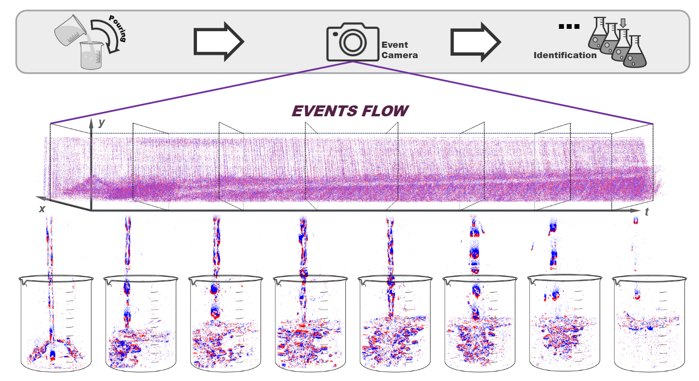
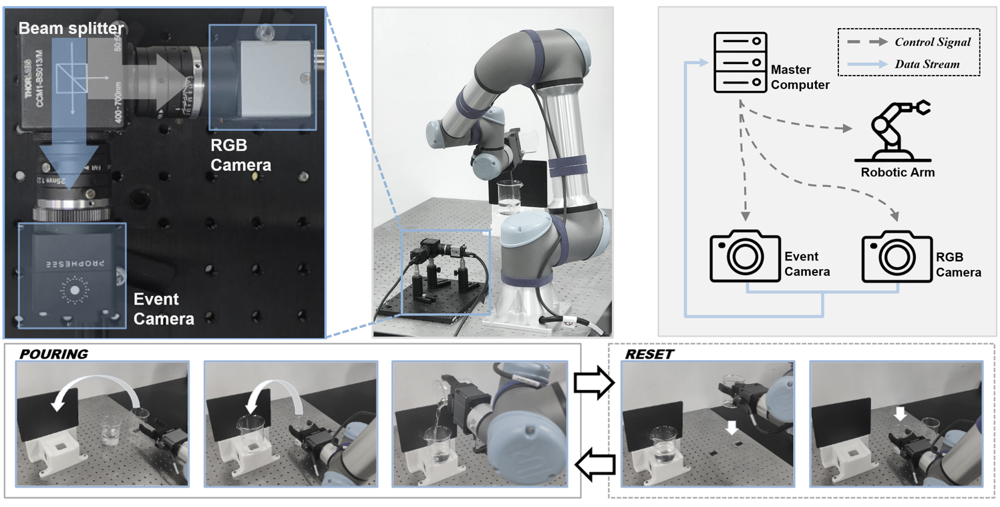
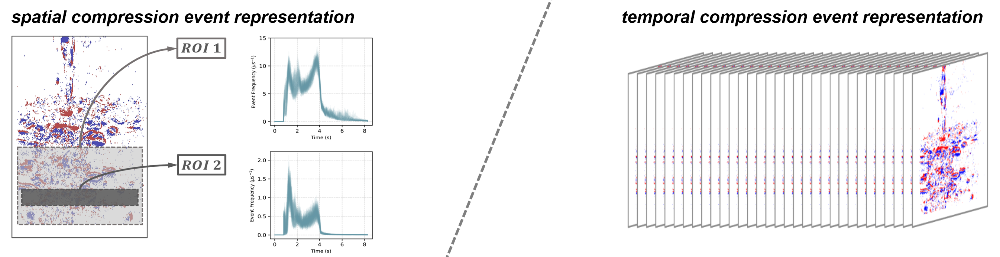

# NLID

### Introduction

The home page of paper ***Bubbles Talk: A Neuromorphic Dataset for Liquid Identification from Pouring Process .***

**NLID** dataset is the first **L**arge-Scale **N**euromorphic **L**iquid **ID**entification dataset, which is available at: [https://huggingface.co/datasets/GWDx/NLID](https://huggingface.co/datasets/GWDx/NLID).

### Overview

The dataset includes the following key features:

* The dataset is collected using an automated pouring platform to minimize bias from human pouring habits and ensure efficient data collection.
* The dataset consists of pouring processes involving 30+ different types of liquids and over 10k samples, spanning both laboratory reagents and common commercial products.
* The effectiveness is validated across two challenging tasks: Ethanol Solution Concentration Prediction and Broad-scope Liquid classification,  achieving *5.92* MSE and *99.19%* accuracy respectively.

### Data Visualization

https://github.com/user-attachments/assets/04cec122-c8bd-4a03-a5e2-fb72064fc978

#### Pouring system settings

The automated data collection platform with a robotic arm to perform automated pouring is developed, and a dual-camera setup is employed to synchronously collect events and videos from the scene.

For event/RGB synchronous acquisition, please refer to ``./data-recording``. The dumping action alternates between **pouring** and **reset** operations.
In ``./data-recording/README.md`` a guide for the deployment process of the automated pouring platform is provided.

Please refer to the  ``./Chemliquids.txt``   file for liquid types and physical properties in the dataset.

### Event representations

For spatial and temporal compression of event representations, please refer to file ``./Temporal_compression\/utils/Data_processing_raw_classification.py`` and file ``./Spatial_compression/preprocess/batch-process-deltat.py``.

### Model Deployment

For the model deployment and environmental requirements , please refer to folder ``./Temporal_compression`` for event stream temporal compression representation and refer to folder ``./Spatial_compression`` for  spatial compression representation.
